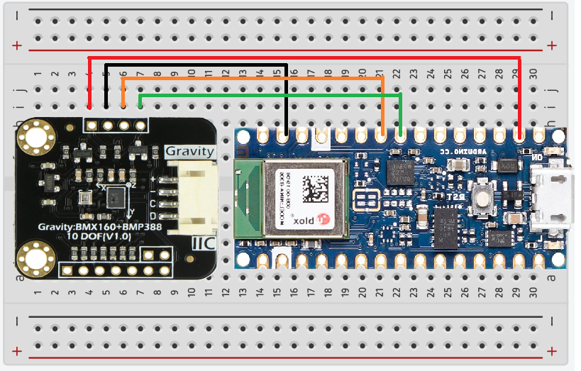

# IndoorDeadReckoning

    

## Objective
To create an indoor navigation system based on dead reckoning, to track objects in a complex indoor environment. The critical concepts used in this project are as follows

* Yaw estimation (absolute heading)
* Step detection
* Step length estimation
* Altitude determination

## Software needed to replicate the project

* [Arduino IDE version 2.3.4](https://www.arduino.cc/en/software)
* [Processing version 4.3.1](https://processing.org/download) 

Please note that this project is not being updated for subsequent versions of the softwares used. Version errors often accompany new versions of software. In such a case, the recommended (last known working) versions of the softwares are mentioned for 1:1 replication. 

## Hardware needed to replicate the project

* [Arduino Nano 33 BLE](https://docs.arduino.cc/hardware/nano-33-ble/)
* [Arduino Nano 33 IoT](https://docs.arduino.cc/hardware/nano-33-iot/) (Used only as a BLE Beacon)
* [Gravity BMX160+BMP388 10 DOF Sensor SEN0252](https://wiki.dfrobot.com/Gravity%3A%20BMX160%2BBMP388%2010%20DOF%20Sensor%20SKU%3A%20SEN0252)

## Circuit Diagram

